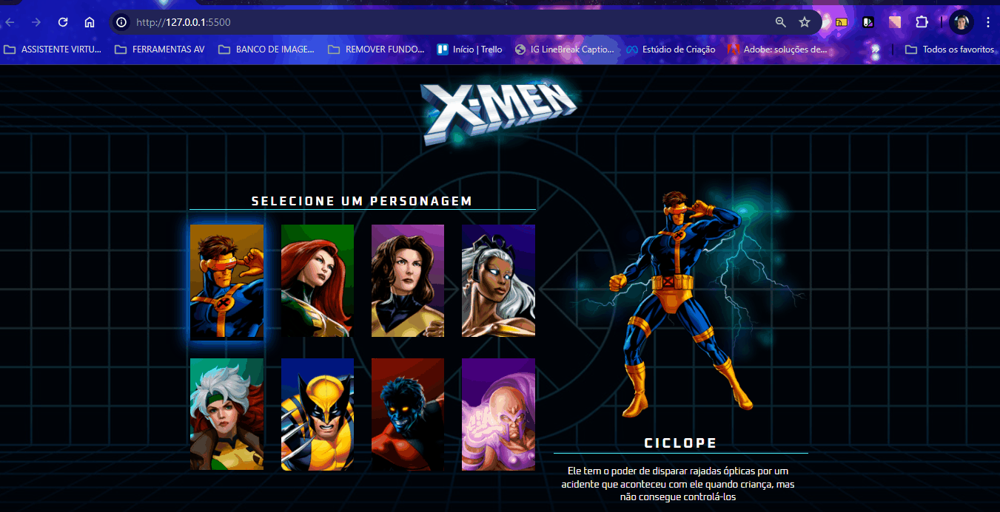

# Projeto Seleção de personagens X-Men

Um projeto do site dos personagens do X-Men com logotipo, menu contendo os personagens para serem selecionados a esquerda, e quando selecionado, o personagem apareça a direita num formato grande com o nome e a descrição. Para telas de desktops, tablets e celulares 📲💻

## Tecnologias utilizadas
- HTML
- CSS
- JAVASCRIPT

## 📂 Acesso ao projeto

Você pode acessar o código fonte do projeto 

<https://github.com/denisero19/selecao-de-personagens-xmen>
